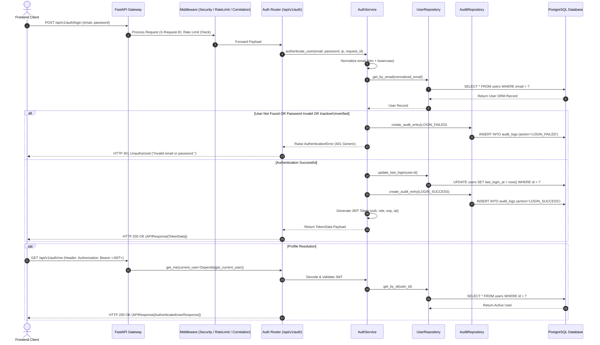

# SmartPack AI — Authentication Backend Technical Architecture

## Overview

Sprint 1.2 establishes the production-grade authentication and authorization backend for **SmartPack AI**. Built on top of **FastAPI**, **SQLAlchemy 2.x**, and **PostgreSQL**, it delivers secure JWT Bearer token generation, email normalization, bcrypt password verification, role-based access control (RBAC), and immutable security audit event trailing.

---

## Authentication Sequence Flow



---

## Technical Specifications

### 1. API Endpoints

#### `POST /api/v1/auth/login`
* **Purpose**: Authenticates user credentials and issues a signed JWT access token.
* **Rate Limiting**: Protected by `RateLimitMiddleware` (60 requests/minute default).
* **Request Payload**:
  ```json
  {
    "email": "  OPERATOR.JOHN@SMARTPACK.AI  ",
    "password": "SecurePassword123!"
  }
  ```
* **Success Response (HTTP 200 OK)**:
  ```json
  {
    "success": true,
    "data": {
      "access_token": "eyJhbGciOiJIUzI1NiIsInR5cCI6IkpXVCJ9...",
      "token_type": "bearer",
      "expires_in": 3600,
      "user": {
        "id": "33333333-3333-4333-8333-333333333333",
        "full_name": "John Operator",
        "email": "operator.john@smartpack.ai",
        "role": "OPERATOR",
        "store_id": null,
        "is_active": true,
        "is_verified": true
      }
    }
  }
  ```
* **Error Response (HTTP 401 Unauthorized)**:
  ```json
  {
    "success": false,
    "error": {
      "code": "AUTHENTICATION_FAILED",
      "message": "Invalid email or password.",
      "details": null
    }
  }
  ```

#### `GET /api/v1/auth/me`
* **Purpose**: Fetches the authenticated user profile using Bearer JWT authentication.
* **Authentication**: Requires valid HTTP header `Authorization: Bearer <access_token>`.
* **Success Response (HTTP 200 OK)**:
  ```json
  {
    "success": true,
    "data": {
      "id": "33333333-3333-4333-8333-333333333333",
      "full_name": "John Operator",
      "email": "operator.john@smartpack.ai",
      "role": "OPERATOR",
      "store_id": null,
      "is_active": true,
      "is_verified": true
    }
  }
  ```

---

### 2. JWT Access Token Design

Tokens are signed using **HS256** with `python-jose` and configured via `JWT_SECRET`.

| Claim | Key | Type | Description |
|---|---|---|---|
| **Subject** | `sub` | `String (UUID)` | Authenticated User ID string (e.g. `"33333333-3333-4333-8333-333333333333"`). |
| **Role** | `role` | `String` | User's security role identifier (`"ADMIN"`, `"SUPERVISOR"`, `"OPERATOR"`). |
| **Issued At** | `iat` | `Integer` | UTC Epoch timestamp of token generation. |
| **Expiration** | `exp` | `Integer` | UTC Epoch timestamp when token expires (`iat + ACCESS_TOKEN_EXPIRE_MINUTES * 60`). |

> [!SECURITY]
> JWT tokens intentionally exclude passwords, password hashes, or sensitive PII.

---

### 3. Role-Based Access Control (RBAC) Foundation

Authorization dependencies in [`backend/src/api/deps.py`](file:///d:/SmartPackAI/backend/src/api/deps.py) enforce role permissions:

```python
from src.api.deps import require_roles

# Example route requiring ADMIN permission
@router.get("/admin/settings", dependencies=[Depends(require_roles("ADMIN"))])
def get_admin_settings():
    ...

# Example route requiring ADMIN or SUPERVISOR permission
@router.get("/supervisor/override", dependencies=[Depends(require_roles("ADMIN", "SUPERVISOR"))])
def supervisor_override():
    ...
```

* **Database Authority**: `require_roles` resolves the user's current role directly from PostgreSQL, ensuring role updates take effect immediately without waiting for token re-issuance.
* **HTTP 403 Forbidden**: Unauthorized role access raises `AuthorizationError` (`"code": "PERMISSION_DENIED"`).

---

### 4. Security & Audit Trail Policy

1. **User Enumeration Prevention**: All login failures (unknown email, incorrect password, inactive account, unverified account) return a generic `401 Unauthorized` message: `"Invalid email or password."`
2. **Audit Events**:
   * `LOGIN_SUCCESS`: Logged on valid credentials with `user_id`, client IP address, and correlation `request_id`.
   * `LOGIN_FAILED`: Logged on invalid credentials or account state violations with client IP address and `request_id`.
3. **Password Security**: Verification reuses `verify_password()` from [`backend/src/security/hashing.py`](file:///d:/SmartPackAI/backend/src/security/hashing.py). Passwords are never written to logs or error output.
