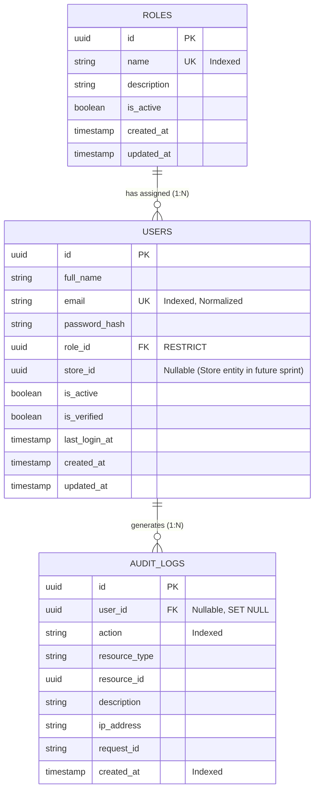

# SmartPack AI — Authentication Database Foundation Documentation

## Overview

Sprint 1.1 establishes the core PostgreSQL database schema for identity, role-based access control (RBAC), and security audit trailing. Built using **SQLAlchemy 2.x** declarative typed models and managed via **Alembic** migrations.

---

## Entity Relationship Diagram (ERD)

> [!NOTE]
> `USERS.store_id` is defined as a nullable UUID column without a foreign key constraint. The `Store` model and table will be introduced in a future sprint, at which point a schema migration will add the FK relationship constraint.

---

## Table Specifications

### 1. `roles`

**Purpose**: Stores application security roles defining permissions and administrative boundaries across dark store operations.

| Column | Data Type | Constraints | Default | Description |
|---|---|---|---|---|
| `id` | `UUID` | Primary Key | `uuid4()` | Unique role identifier. |
| `name` | `VARCHAR(50)` | `NOT NULL`, `UNIQUE`, `INDEX` | - | Role name identifier (`ADMIN`, `SUPERVISOR`, `OPERATOR`). |
| `description` | `TEXT` | `NULLABLE` | `NULL` | Detailed description of role responsibilities. |
| `is_active` | `BOOLEAN` | `NOT NULL` | `true` | Indicates whether role is active. |
| `created_at` | `TIMESTAMPTZ` | `NOT NULL` | `now()` | UTC creation timestamp. |
| `updated_at` | `TIMESTAMPTZ` | `NOT NULL` | `now()` | UTC update timestamp. |

**Initial Seed Data**:
* `ADMIN`: System administrator with full system and dark store management access.
* `SUPERVISOR`: Store supervisor with override and verification validation capabilities.
* `OPERATOR`: Packing operator performing order verification on store floor.

---

### 2. `users`

**Purpose**: Stores authenticated application users, credentials (bcrypt hashes), role linkages, and verification status.

| Column | Data Type | Constraints | Default | Description |
|---|---|---|---|---|
| `id` | `UUID` | Primary Key | `uuid4()` | Unique user identifier. |
| `full_name` | `VARCHAR(255)` | `NOT NULL` | - | Full display name of the operator/user. |
| `email` | `VARCHAR(255)` | `NOT NULL`, `UNIQUE`, `INDEX` | - | Normalized user email (trimmed + lowercased). |
| `password_hash` | `VARCHAR(255)` | `NOT NULL` | - | Bcrypt password hash string. |
| `role_id` | `UUID` | `NOT NULL`, `FK(roles.id ON DELETE RESTRICT)`, `INDEX` | - | Linkage to assigned security role. |
| `store_id` | `UUID` | `NULLABLE` | `NULL` | Dark store assignment ID (FK pending Store model). |
| `is_active` | `BOOLEAN` | `NOT NULL` | `true` | Account active status. |
| `is_verified` | `BOOLEAN` | `NOT NULL` | `false` | Email/identity verification status. |
| `last_login_at` | `TIMESTAMPTZ` | `NULLABLE` | `NULL` | UTC timestamp of last login. |
| `created_at` | `TIMESTAMPTZ` | `NOT NULL` | `now()` | UTC creation timestamp. |
| `updated_at` | `TIMESTAMPTZ` | `NOT NULL` | `now()` | UTC update timestamp. |

#### Email Normalization Policy
All email addresses undergo automatic normalization prior to persistence via SQLAlchemy model validation (`@validates('email')`):
1. **Trim Whitespace**: Surrounding spaces, tabs, or newlines are stripped (`email.strip()`).
2. **Lowercase Conversion**: String is converted entirely to lowercase (`email.lower()`).
3. **Uniqueness Guarantee**: Database uniqueness indexes operate on normalized values to prevent duplicate accounts (`Admin@example.com` and `admin@example.com` are stored as the same identity).

#### Password Storage Policy
* **Zero Plaintext Storage**: Plaintext passwords are never accepted for column storage or written to log files.
* **Bcrypt Hashing**: Password strings are hashed using `passlib[bcrypt]` prior to database insertion.

---

### 3. `audit_logs`

**Purpose**: Immutable log table capturing security events, authentication attempts, user lifecycle updates, and administrative overrides.

| Column | Data Type | Constraints | Default | Description |
|---|---|---|---|---|
| `id` | `UUID` | Primary Key | `uuid4()` | Unique audit event identifier. |
| `user_id` | `UUID` | `NULLABLE`, `FK(users.id ON DELETE SET NULL)`, `INDEX` | `NULL` | User associated with event (`NULL` if unauthenticated). |
| `action` | `VARCHAR(100)` | `NOT NULL`, `INDEX` | - | Audit action (e.g. `LOGIN`, `USER_CREATED`, `ACCESS_DENIED`). |
| `resource_type` | `VARCHAR(100)` | `NULLABLE` | `NULL` | Target resource category (`USER`, `ORDER`, `VERIFICATION`). |
| `resource_id` | `UUID` | `NULLABLE` | `NULL` | Target resource identifier. |
| `description` | `TEXT` | `NULLABLE` | `NULL` | Human-readable log details or audit notes. |
| `ip_address` | `VARCHAR(45)` | `NULLABLE` | `NULL` | Origin IPv4 / IPv6 address. |
| `request_id` | `VARCHAR(100)` | `NULLABLE` | `NULL` | Correlation `X-Request-ID` token. |
| `created_at` | `TIMESTAMPTZ` | `NOT NULL`, `INDEX` | `now()` | UTC timestamp of audit event occurrence. |

---

## Foreign Key Deletion Behaviors

1. **`users.role_id` -> `roles.id` (`ondelete="RESTRICT"`)**:
   * Attempting to delete a `Role` while users are assigned to it raises a database constraint error (`IntegrityError`).
   * Guarantees system roles (`ADMIN`, `SUPERVISOR`, `OPERATOR`) cannot be deleted out from under active operators.
2. **`audit_logs.user_id` -> `users.id` (`ondelete="SET NULL"`)**:
   * Deleting a `User` record retains all associated `audit_logs` entries, automatically updating `user_id` to `NULL`.
   * Ensures immutability of audit history for compliance and security investigations.
