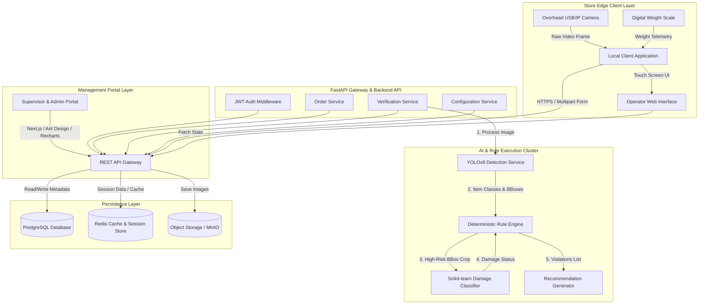
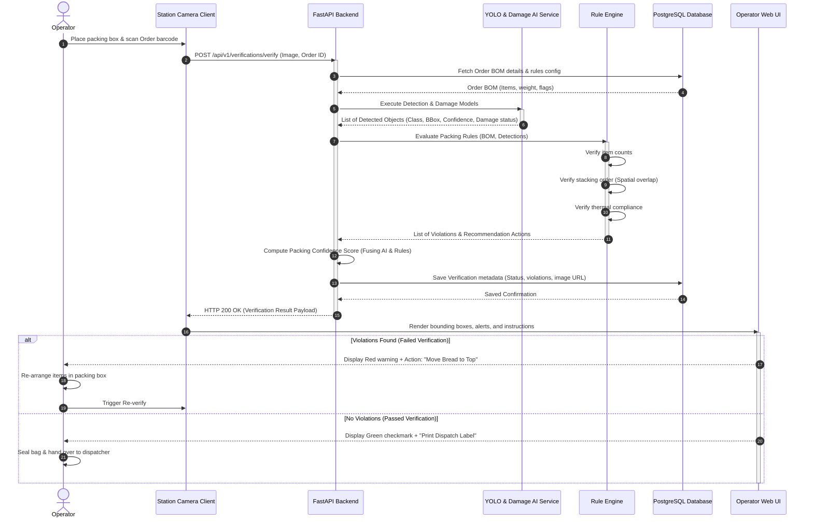

# SmartPack AI: Enterprise Software Architecture Specification
**AI-Powered Packing Quality Verification Platform for Dark Store Operations**
**Document Version:** 1.0.0  
**Author:** Principal Solution Architect & Technical Documentation Expert

---

## Table of Contents
1. [Project Vision](#1-project-vision)
2. [Scope of Work](#2-scope-of-work)
3. [Stakeholder Analysis](#3-stakeholder-analysis)
4. [Functional Requirements (FR)](#4-functional-requirements-fr)
5. [Non-Functional Requirements (NFR)](#5-non-functional-requirements-nfr)
6. [System Modules](#6-system-modules)
7. [High-Level System Architecture](#7-high-level-system-architecture)
8. [Data Flow & Sequence Diagrams](#8-data-flow--sequence-diagrams)
9. [Technology Justification](#9-technology-justification)
10. [Database Schema & Entity Relationship Planning](#10-database-schema--entity-relationship-planning)
11. [API Endpoint Design](#11-api-endpoint-design)
12. [AI, Computer Vision, & Rule Engine Design](#12-ai-computer-vision--rule-engine-design)
13. [Dashboard & KPI Planning](#13-dashboard--kpi-planning)
14. [Prototype Screen Walkthroughs](#14-prototype-screen-walkthroughs)
15. [Enterprise Folder Structure](#15-enterprise-folder-structure)
16. [Coding & API Standards](#16-coding--api-standards)
17. [Security Architecture & Secrets Management](#17-security-architecture--secrets-management)
18. [Testing & Quality Assurance Strategy](#18-testing--quality-assurance-strategy)
19. [Risk Assessment & Mitigation Matrix](#19-risk-assessment--mitigation-matrix)
20. [Development Roadmap & Implementation Phases](#20-development-roadmap--implementation-phases)
21. [System Limitations & Trade-offs Report](#21-system-limitations--trade-offs-report)

---

## 1. Project Vision

### 1.1 Mission
To eliminate post-dispatch grocery packaging and quality defects in high-velocity dark stores by integrating real-time computer vision and deterministic rule validation directly into the packing workflow, ensuring zero-defect deliveries to customers.

### 1.2 Business Objectives
*   **Reduce Refund and Replacement Costs:** Decrease delivery refunds due to damaged, leaking, or missing items by 45% within the first six months of deployment.
*   **Enhance Packing Speed and Accuracy:** Keep packing verification cycle times under 1.2 seconds, ensuring no negative impact on the store's average 10-minute order-to-dispatch SLA.
*   **Boost Net Promoter Score (NPS):** Elevate customer satisfaction by reducing delivery complaints related to packaging quality from 3.2% to under 0.5%.
*   **Improve Operator Accountability:** Provide detailed historical metrics on individual operator error rates, facilitating targeted retraining.

### 1.3 Problem Statement
Dark stores operate on razor-thin timelines, aiming to fulfill grocery orders within 8 to 12 minutes of receipt. In this high-stress, high-throughput environment, warehouse operators frequently make packing errors, such as:
1.  Placing heavy items (e.g., milk cartons, water bottles) on top of fragile items (e.g., bread, eggs, tomatoes).
2.  Omitting insulation bags for frozen goods, causing them to melt en route.
3.  Packing items that are already visibly damaged, bruised, or leaking.
4.  Mismatching item counts against the customer order list.

Because these errors are currently discovered only after dispatch (by the customer or delivery partner), dark store operators suffer significant financial losses from refunds, redeliveries, and customer churn.

### 1.4 Value Proposition
SmartPack AI acts as an automated, non-intrusive quality auditor positioned above every packing station. By analyzing images of the packing bin instantly, it flags structural packing issues, item count mismatches, and item damage before the bag is sealed and dispatched. This guarantees quality at the source, transforming reactive store logistics into proactive, zero-defect operations.

### 1.5 Success Criteria
| Metric | Baseline | Target (V1) | Measurement Method |
| :--- | :--- | :--- | :--- |
| **Verification Latency** | N/A | $\le 1.2\text{ seconds}$ | End-to-end telemetry from image capture to UI prompt |
| **Object Detection mAP@0.5** | N/A | $\ge 92.0\%$ | Validation dataset evaluations on YOLOv8 |
| **Damage Classification Accuracy**| N/A | $\ge 88.0\%$ | Confusion matrix validation on test dataset |
| **Post-Dispatch Refund Claims** | 3.5% | $\le 1.0\%$ | WMS (Warehouse Management System) financial logs |
| **Operator Override Rate** | N/A | $\le 5.0\%$ | Supervisor verification logs for disputed alerts |

---

## 2. Scope of Work

### 2.1 In Scope
*   **Camera Integration Client:** Lightweight software to capture frames from overhead USB/IP cameras at packing stations and stream them to the API.
*   **Core Computer Vision Models:** Object detection (YOLOv8) trained on dark store inventory and binary/multiclass classification (Scikit-learn/ResNet) for product damage.
*   **Deterministic Rule Engine:** Verification layer mapping detected coordinates against the WMS bill of materials (BOM) and checking stacking safety and thermal constraints.
*   **Operator Packing Verification UI:** Touch-screen web UI displaying green/red status, identified packaging errors, and recommended corrections.
*   **Supervisor Operations Dashboard:** Admin portal showing real-time store metrics, station health, pending supervisor overrides, and operational analytics.
*   **Simulated Datasets:** Scripted operational and visual datasets to validate the system without requiring physical hardware in the initial testing phase.

### 2.2 Out of Scope
*   **Physical Camera Installation:** Mounting hardware, cabling, and local warehouse network configurations.
*   **Barcode Scanner Software:** Integrations with physical handheld barcode scanners (assumed to interface directly with WMS).
*   **Automated Sortation Integration:** Diverting bags on conveyor belts (limited to API notifications).
*   **Customer-Facing Notification System:** Direct customer SMS/Email alerts (handled by existing CRM tools).

### 2.3 Version 1 Roadmap (MVP)
*   Deploy YOLOv8 model recognizing 15 core high-risk grocery classes (e.g., Eggs, Bread, Milk, Soft Drinks, Bananas, Apples, Detergent).
*   Implement deterministic rules: Fragile Stacking Rule (Bread/Eggs cannot be under Milk/Drinks), Thermal bag rule (Ice cream requires insulated packaging), and Item Mismatch rule.
*   FastAPI backend with local SQLite database for mock testing, migration capability to PostgreSQL.
*   Web dashboard for supervisors to view shift logs and perform overrides.

### 2.4 Future Version Roadmap
*   **Version 2.0:** Multi-camera views to detect items buried beneath other layers; integration with digital smart-scales to verify weight profiles dynamically.
*   **Version 3.0:** Generative AI synthetic dataset generator to train models on new inventory packaging shapes instantly; edge computing nodes (NVIDIA Jetson) deployed inside dark stores for fully offline local inference.

---

## 3. Stakeholder Analysis

```
+------------------+     +------------------+     +------------------+
| Warehouse        |     | Shift            |     | Store Admin      |
| Operator         |     | Supervisor       |     | / DevOps         |
+--------+---------+     +--------+---------+     +--------+---------+
         |                        |                        |
         v                        v                        v
  Packs orders,            Resolves overrides,     Configures rules,
  corrects mistakes,       audits operator logs,   monitors system,
  views live alerts.       manages shift metrics.  deploys ML models.
```

| Stakeholder | Key Goals | Responsibilities | System Interaction |
| :--- | :--- | :--- | :--- |
| **Warehouse Operator** | Pack orders quickly and accurately without dropping speed. | Scans order, packs items under camera, fixes errors flagged by the UI. | Interacts with the **Operator Verification Screen** using touch input. |
| **Shift Supervisor** | Maintain dark store fulfillment SLAs, resolve packing conflicts, and oversee staff. | Reviews operator override requests, audits packing errors, monitors store bottlenecks. | Accesses the **Supervisor Override Queue** and performance dashboards. |
| **Store Administrator** | Configure operational rules, manage store inventories, and assign user permissions. | Updates product master data, modifies rule engine parameters, creates operator logins. | Accesses the **System Settings** and **User Management** portals. |
| **Business Manager** | Maximize store margins, minimize operational waste, and monitor refund claims. | Analyzes high-level operational reports, correlates packing errors with refund statistics. | Interacts with the **Analytics & Reports Portal**. |
| **System Administrator** | Ensure high system uptime, low API latency, and data integrity. | Manages database backups, provisions servers, deploys model updates, monitors logs. | Uses backend CLI, application monitoring tools, and cloud portals. |
| **End Customer** | Receive complete, undamaged grocery orders within the promised timeframe. | Receives delivery, reports missing or damaged items if any. | None directly (beneficiary of system outputs). |

---

## 4. Functional Requirements (FR)

### 4.1 Authentication & User Management
*   **FR-AUT-001:** The system shall authenticate users using JSON Web Tokens (JWT) via username and password.
*   **FR-AUT-002:** The system shall enforce Role-Based Access Control (RBAC) supporting Operator, Supervisor, Admin, and Business Manager roles.
*   **FR-USR-001:** The Admin shall be able to create, read, update, and deactivate operator user accounts.

### 4.2 Order Ingestion
*   **FR-ORD-001:** The system shall ingest order bills of materials (BOM) from an external WMS via a REST endpoint.
*   **FR-ORD-002:** The system shall map expected item counts, fragile flags, and packaging requirements for every ingested order.

### 4.3 Image Capture & Processing
*   **FR-IMG-001:** The system client shall automatically trigger camera capture when the weight scale stabilizes or when the operator presses a "Verify" button.
*   **FR-IMG-002:** The system client shall upload the high-resolution JPEG image along with the metadata (`order_id`, `station_id`) to the backend API.

### 4.4 Computer Vision & Inference
*   **FR-AIE-001:** The backend shall run a YOLOv8 object detector to locate and classify packed items in the uploaded image.
*   **FR-AIE-002:** The backend shall crop detected item regions and run a damage classification model to detect structural defects (crushed items, leaks).
*   **FR-AIE-003:** The system shall compute bounding box coordinates $(x_{min}, y_{min}, x_{max}, y_{max})$ and confidence scores for each item.

### 4.5 Packing Validation & Rule Engine
*   **FR-RUL-001:** The rule engine shall match detected items against the expected items in the order BOM to identify missing or extra items.
*   **FR-RUL-002:** The rule engine shall detect heavy-on-fragile violations by analyzing vertical coordinate overlaps of bounding boxes.
*   **FR-RUL-003:** The rule engine shall verify that temperature-sensitive items are packed inside insulated bags by checking class co-occurrence (e.g., Ice Cream and Thermal Bag).
*   **FR-RUL-004:** The system shall generate a composite packing quality confidence score based on detection confidence and rule compliance.

### 4.6 Verification & Override Workflow
*   **FR-VER-001:** The system shall return visual bounding boxes color-coded by status (Green = Pass, Red = Violation, Orange = Warning) to the UI.
*   **FR-VER-002:** The system shall display actionable text instructions for corrections when a rule violation occurs.
*   **FR-VER-003:** The operator shall be blocked from sealing/confirming the order if a "Critical" violation is flagged.
*   **FR-VER-004:** The operator shall be able to request a supervisor override if they believe the AI detection is a false positive.
*   **FR-VER-005:** The supervisor shall be able to approve or reject an override request from their dashboard, adding an audit comment.

### 4.7 Reports & Analytics
*   **FR-REP-001:** The system shall calculate daily performance indicators: Verification Pass Rate, Average Cycle Time, and Alert Override Count.
*   **FR-REP-002:** The Business Manager shall be able to export historical CSV reports of rule violations, operator stats, and damage metrics.

---

## 5. Non-Functional Requirements (NFR)

### 5.1 Performance & Latency
*   **NFR-PER-001:** The computer vision and damage inference pipeline must execute in under $600\text{ ms}$ on target GPU environments.
*   **NFR-PER-002:** The end-to-end API response time (HTTP request to JSON response containing boxes) must be $\le 1.2\text{ seconds}$ on standard warehouse network lines.

### 5.2 Availability & Reliability
*   **NFR-AVL-001:** The backend API and dashboard must achieve $99.9\%$ uptime during dark store operational hours (e.g., 06:00 to 02:00 local time).
*   **NFR-REL-001:** If the central database is unreachable, the local client application must queue verification data in an offline SQLite cache and sync when online.

### 5.3 Security & Compliance
*   **NFR-SEC-001:** All communication between the camera client, frontend, and backend API must be encrypted using TLS 1.3.
*   **NFR-SEC-002:** Passwords must be hashed using `bcrypt` (work factor 12) before storage in PostgreSQL.
*   **NFR-SEC-003:** Images stored in object storage must be assigned randomly generated UUIDs to prevent enumeration attacks.

### 5.4 Scalability & Maintainability
*   **NFR-SCA-001:** The FastAPI system must scale horizontally to handle up to 100 concurrent packing station streams per warehouse facility.
*   **NFR-MNT-001:** The backend code must maintain $\ge 80\%$ test coverage on unit modules to ensure code maintainability.
*   **NFR-MNT-002:** Database schemas must be versioned and applied using `Alembic` migration scripts.

### 5.5 Usability & Accessibility
*   **NFR-USA-001:** The Operator UI must be optimized for 10-inch capacitive touch screens, with clickable target elements measuring at least $48\text{px} \times 48\text{px}$.
*   **NFR-ACC-001:** The administrative dashboard must comply with WCAG 2.1 AA standards for color contrast and keyboard navigation.

### 5.6 Logging & Auditing
*   **NFR-LOG-001:** The system must output application logs in structured JSON format to stdout for collection by Elasticsearch/Fluentd.
*   **NFR-AUD-001:** Every supervisor override must be logged in an audit table containing the supervisor ID, timestamp, operator ID, image URL, and text reason.

---

## 6. System Modules

### 6.1 Authentication Module (`auth`)
Handles token generation, password checks, session management, and authorization middleware. It extracts the client's JWT payload and checks claims against route permissions (RBAC).

### 6.2 Order Ingestion Module (`orders`)
Exposes REST endpoints for the external WMS to register incoming orders. It parses item details, weights, packaging materials, and special tags (fragile, frozen, hazardous).

### 6.3 Packing Verification Module (`verification`)
The central orchestrator. It receives raw images from the operator stations, passes them to the AI engine, feeds the results to the rule engine, constructs the final confidence payload, and updates order states.

### 6.4 Computer Vision Module (`cv_engine`)
Wraps the YOLOv8 model and OpenCV utilities. It handles image resizing, color conversions, model inference, non-maximum suppression (NMS), and generates object classification lists with confidence scores.

### 6.5 Rule Engine Module (`rule_engine`)
Translates business packing rules into deterministic logical checks. It runs spatial analysis algorithms (calculating overlapping bounding box coordinates) and thermal co-occurrence checks.

### 6.6 Damage Prediction Module (`damage_classifier`)
Uses regional image crops generated by the CV module. It classifies items into "intact" or "damaged" states using pre-trained visual feature extractors and Scikit-learn classification models.

### 6.7 Recommendation Engine (`recommender`)
Translates rule violations and damage predictions into clean, actionable instructions (e.g., *"Move Bread to the top of the box to prevent crushing"*).

### 6.8 Reports & Analytics Module (`analytics`)
Aggregates transactional database logs to compile operational KPIs. It exposes query endpoints filtering by date ranges, shifts, operator IDs, and violation types for the charts.

### 6.9 User Management Module (`users`)
Provides admin interfaces to create and edit user profiles, assign roles, reset passwords, and track user performance metrics.

### 6.10 Settings Module (`settings`)
Manages application-wide configurations, such as YOLO confidence thresholds, rules activation toggles, and camera calibration details.

---

## 7. High-Level System Architecture



---

## 8. Data Flow & Sequence Diagrams



---

## 9. Technology Justification

| Stack Layer | Technology Chosen | Alternatives Evaluated | Justification & Comparison |
| :--- | :--- | :--- | :--- |
| **Frontend Framework** | **Next.js + TS** | React SPA (Vite) | Next.js offers native server-side rendering for administrative dashboards, pre-fetching routes, built-in layout management, and seamless production deployments. TypeScript ensures payload contract type-safety between API models and frontend components. |
| **UI Library** | **Ant Design** | Tailwind CSS (custom components) | Ant Design provides a comprehensive suite of polished, enterprise-ready components (tables, modals, forms, trees) out of the box, matching the aesthetics of logistics platforms like Amazon Fulfillment and Zepto. |
| **Backend Engine** | **FastAPI** | Django / Flask | FastAPI is built on ASGI, offering native asynchronous processing which is crucial for handling concurrent HTTP streams. It automates OpenAPI schema generation and outperforms Flask and Django under high-throughput workloads. |
| **Primary Database** | **PostgreSQL** | MongoDB (NoSQL) | Packing rules require highly structured relationships linking orders, items, operator shifts, overrides, and audit trails. PostgreSQL guarantees ACID compliance and supports advanced JSONB processing for flexible rule data storage. |
| **ORM** | **SQLAlchemy** | Django ORM / Tortoise ORM | SQLAlchemy provides enterprise-grade datamapping, fine-grained control over transactions, connection pooling, and matches cleanly with Alembic for database migrations. |
| **Object Detection** | **YOLOv8** | Faster R-CNN / SSD | YOLOv8 delivers state-of-the-art inference speeds ($\le 30\text{ ms}$ on CUDA), crucial for the $600\text{ ms}$ processing threshold. SSD has lower accuracy, and Faster R-CNN is too resource-heavy for real-time edge processing. |
| **Analytics Engine** | **Scikit-learn** | PyTorch custom models | Used for the Damage Classifier. Extracting spatial image features (e.g., color saturation for leaks, edge histogram shapes for damage) and feeding them to Scikit-learn Classifiers (SVM/Random Forest) is much lighter and easier to retrain than full PyTorch deep models. |
| **Charts** | **Recharts** | Chart.js / D3.js | Recharts is built specifically for React, using declarative SVG components that render cleanly, adapt to responsive grids, and animate out of the box. |

---

## 10. Database Schema & Entity Relationship Planning

### 10.1 Entity List & Major Attributes
```
+------------------+         +------------------+         +------------------+
|      users       |1       N|   verifications  |1       N|  detected_items  |
| (Operators/Admins|---------| (Verification    |---------| (YOLO coordinates|
|   & Supervisors) |         |  runs / status)  |         |  and confidence) |
+------------------+         +--------+---------+         +------------------+
                                      |1
                                      |
                                      |N
                             +--------+---------+
                             |  rule_violations |
                             | (Stacking/thermal|
                             |  mismatches)     |
                             +------------------+
```

1.  **`users`**: Manages credentials and roles.
    *   `id` (UUID, Primary Key)
    *   `username` (VARCHAR, Unique)
    *   `password_hash` (VARCHAR)
    *   `role` (ENUM: Operator, Supervisor, Admin, Manager)
    *   `status` (ENUM: Active, Suspended)
    *   `created_at`, `updated_at` (TIMESTAMP)

2.  **`orders`**: Ingested order master records.
    *   `id` (UUID, Primary Key)
    *   `wms_order_id` (VARCHAR, Unique)
    *   `customer_id` (VARCHAR)
    *   `status` (ENUM: Pending, Packing, Verified, Dispatched, Cancelled)
    *   `package_type` (ENUM: StandardBag, InsulatedBag, FragileBox)
    *   `total_weight_g` (INTEGER)
    *   `created_at`, `updated_at` (TIMESTAMP)

3.  **`order_items`**: Line items inside an order.
    *   `id` (UUID, Primary Key)
    *   `order_id` (UUID, Foreign Key referencing `orders.id`)
    *   `product_sku` (VARCHAR)
    *   `product_name` (VARCHAR)
    *   `expected_quantity` (INTEGER)
    *   `unit_weight_g` (INTEGER)
    *   `is_fragile` (BOOLEAN)
    *   `requires_insulation` (BOOLEAN)

4.  **`verifications`**: Transaction history of packing scans.
    *   `id` (UUID, Primary Key)
    *   `order_id` (UUID, Foreign Key referencing `orders.id`)
    *   `operator_id` (UUID, Foreign Key referencing `users.id`)
    *   `image_url` (VARCHAR)
    *   `status` (ENUM: Pass, Fail, Overridden)
    *   `confidence_score` (DECIMAL)
    *   `inference_time_ms` (INTEGER)
    *   `override_by_id` (UUID, Nullable Foreign Key referencing `users.id`)
    *   `override_reason` (TEXT, Nullable)
    *   `created_at` (TIMESTAMP)

5.  **`detected_items`**: Every object instance located by YOLOv8.
    *   `id` (UUID, Primary Key)
    *   `verification_id` (UUID, Foreign Key referencing `verifications.id`)
    *   `class_name` (VARCHAR)
    *   `confidence` (DECIMAL)
    *   `bbox_x_min`, `bbox_y_min`, `bbox_x_max`, `bbox_y_max` (INTEGER)

6.  **`rule_violations`**: Infractions flagged by the rule engine.
    *   `id` (UUID, Primary Key)
    *   `verification_id` (UUID, Foreign Key referencing `verifications.id`)
    *   `rule_code` (VARCHAR, e.g., `RULE-STR-001`)
    *   `severity` (ENUM: Warning, Critical)
    *   `description` (TEXT)
    *   `resolved_at` (TIMESTAMP, Nullable)

7.  **`damage_predictions`**: Crop-level damage classifier logs.
    *   `id` (UUID, Primary Key)
    *   `verification_id` (UUID, Foreign Key referencing `verifications.id`)
    *   `class_name` (VARCHAR)
    *   `confidence_score` (DECIMAL)
    *   `predicted_damage_type` (ENUM: Leaking, Crushed, Torn, Intact)

---

## 11. API Endpoint Design

### 11.1 Authentication Endpoints
*   `POST /api/v1/auth/login`
    *   *Description:* Authenticate user credentials.
    *   *Request:* `{"username": "jdoe", "password": "securepassword"}`
    *   *Response:* `{"access_token": "eyJhbG...", "token_type": "bearer", "expires_in": 900}`
*   `GET /api/v1/auth/me`
    *   *Description:* Get authenticated user session data.
    *   *Headers:* `Authorization: Bearer <token>`
    *   *Response:* `{"id": "uuid-1", "username": "jdoe", "role": "Operator"}`

### 11.2 Order Ingestion Endpoints
*   `POST /api/v1/orders`
    *   *Description:* Register an incoming order from the WMS.
    *   *Request:*
        ```json
        {
          "wms_order_id": "ORD-9988",
          "customer_id": "CUST-441",
          "package_type": "StandardBag",
          "items": [
            {
              "product_sku": "SKU-BREAD-01",
              "product_name": "Sourdough Bread",
              "expected_quantity": 1,
              "is_fragile": true,
              "requires_insulation": false
            }
          ]
        }
        ```
    *   *Response:* `{"status": "Ingested", "order_id": "uuid-order"}`

### 11.3 Verification Endpoints
*   `POST /api/v1/verifications/verify`
    *   *Description:* Upload packed image for instant AI validation.
    *   *Request:* `multipart/form-data` (file: binary image, order_id: string, station_id: string)
    *   *Response:*
        ```json
        {
          "verification_id": "uuid-verify",
          "order_id": "uuid-order",
          "status": "Fail",
          "confidence_score": 0.65,
          "inference_time_ms": 420,
          "detections": [
            {"class_name": "Sourdough Bread", "confidence": 0.95, "bbox": [100, 200, 300, 400]},
            {"class_name": "Amul Milk 1L", "confidence": 0.98, "bbox": [90, 180, 280, 390]}
          ],
          "violations": [
            {
              "rule_code": "RULE-STR-001",
              "severity": "Critical",
              "description": "Fragile item 'Sourdough Bread' is crushed under 'Amul Milk 1L'.",
              "recommendation": "Repack: Place Milk at the bottom and Sourdough Bread on top."
            }
          ]
        }
        ```
*   `POST /api/v1/verifications/{id}/override`
    *   *Description:* Submit supervisor override request.
    *   *Request:* `{"supervisor_id": "uuid-sup", "reason": "AI misidentified packaging artifact as damage"}`
    *   *Response:* `{"status": "Overridden", "verification_id": "uuid-verify"}`

### 11.4 Analytics & Reporting Endpoints
*   `GET /api/v1/analytics/kpis`
    *   *Description:* Fetch shift performance metrics.
    *   *Query Parameters:* `start_date` (ISO date), `end_date` (ISO date), `station_id` (string)
    *   *Response:*
        ```json
        {
          "pass_rate": 0.942,
          "total_scans": 1250,
          "overrides": 12,
          "avg_cycle_time_seconds": 1.15
        }
        ```

---

## 12. AI, Computer Vision, & Rule Engine Design

### 12.1 Computer Vision pipeline (YOLOv8)
*   **Image Preprocessing:** Input camera stream captures images at $1920 \times 1080$. The client normalizes, converts color channels (BGR to RGB), and scales the resolution down to $640 \times 640$ pixels, preserving aspect ratio via letterboxing.
*   **Object Detection Model:** YOLOv8 (specifically YOLOv8m - medium weight) trained on dark store catalog images. The model yields bounding box coordinate arrays and class maps.
*   **Validation dataset details:** Initial validation set consists of 8,500 custom-annotated images capturing common items packaged in various angles and lighting.

### 12.2 Damage Classifier (Scikit-learn)
*   **Pipeline:** For items tagged as fragile or perishable, the corresponding image crop defined by YOLOv8 bounding boxes is extracted.
*   **Feature Vector Extraction:** We use OpenCV to run spatial analysis on the crop (Color Histogram extraction in HSV space to find liquid stains; Edge Gradient distribution to find packaging deformation).
*   **Classification:** These feature vectors are run through a Support Vector Machine (SVM) classifier to identify damage states (Intact vs. Leaking/Crushed).

### 12.3 Deterministic Rule Engine
The system parses spatial constraints mathematically:
1.  **Fragile Stacking Rule (Bread / Eggs safety):**
    *   Let $B_{fragile}$ and $B_{heavy}$ represent bounding boxes.
    *   Let $Y_{max}$ represent the vertical floor coordinate (higher value indicates lower depth in frame).
    *   If $B_{fragile}$ overlaps horizontally with $B_{heavy}$ (calculated as intersection-over-union of x-axis projection):
        $$\text{IoU}_x(B_{fragile}, B_{heavy}) > 0.4$$
    *   And $B_{heavy}$ is positioned higher in space than $B_{fragile}$ (closer to the top of the box, meaning it is stacked over it):
        $$Y_{min}(B_{heavy}) < Y_{min}(B_{fragile})$$
    *   Flag a Critical Stacking Violation (`RULE-STR-001`).

2.  **Thermal Insulation Bag Rule:**
    *   If item SKU list contains class `Ice-Cream` or `Frozen-Meals` AND class `Insulated-Bag` is NOT detected within the frame:
    *   Flag a Warning Thermal Violation (`RULE-TEM-002`).

### 12.4 Confidence Fusion Formula
The system reports a final packing confidence metric:
$$\text{Packing Confidence} = \left( \frac{\sum_{i=1}^{n} c_{yolo, i}}{n} \right) \times (1 - d_{penalty}) \times (1 - \sum r_{penalty})$$
Where:
*   $c_{yolo, i}$: Individual YOLO detection confidence.
*   $d_{penalty}$: Set to $0.5$ if structural damage is detected.
*   $r_{penalty}$: Sum of operational rule infractions (Critical rule = $0.3$ penalty, Warning rule = $0.1$ penalty).

---

## 13. Dashboard & KPI Planning

The Supervisor Dashboard delivers real-time operations performance data, designed for immediate insight.

### 13.1 KPI Metrics Cards
*   **Verification Pass Rate:** Target $\ge 95.0\%$. Real-time gauge card changing color based on performance (Green $\ge 95\%$, Orange $90\text{--}94\%$, Red $< 90\%$).
*   **Average Verification Time:** Target $\le 1.2\text{ seconds}$. Monitors station pipeline processing latencies.
*   **Active Stations:** Shows online/offline station client count (e.g., `12 / 14 Stations Online`).
*   **Overridden Alert Rate:** Tracks supervisor actions. Sudden spikes alert to potential ML false-positive loops.
*   **Prevented Defects:** Running tally of caught damaged/mismatched items, converted to equivalent business savings (e.g., `$1,240 saved today`).

### 13.2 Visual Analytics Charts
1.  **Real-Time Fulfillment Flow (Area Chart):**
    *   *X-axis:* Time (Hour scale).
    *   *Y-axis:* Volume of verifications.
    *   *Series:* Passed Verifications (Green) vs. Failed Verifications (Red).
2.  **Top Rule Violations (Horizontal Bar Chart):**
    *   *X-axis:* Count.
    *   *Y-axis:* Rule code. Identifies recurring operator errors (e.g., Bread-crushing).
3.  **Operator Error Heatmap:**
    *   Tracks packing stations vs. hour of day to highlight shift fatigue patterns.

---

## 14. Prototype Screen Walkthroughs

### 14.1 Login Screen
*   **Layout:** Centered glassmorphic container with enterprise dark mode backdrop.
*   **Input Fields:** Username, Password, Dark Store Location Code dropdown.
*   **Action:** "Login" button triggers JWT token handshake, routing users according to role permissions.

### 14.2 Operator Verification Screen
```
+-----------------------------------------------------------------+
| Station 04 | Operator: Jane Doe          | Order: ORD-9011 (RUN)|
+------------------------------------+----------------------------+
|                                    | Expected Items Checklist   |
|    LIVE OVERHEAD CAMERA VIEW       | [x] Amul Milk 1L (Detected)|
|                                    | [x] Bread 400g   (Detected)|
|    +--------------------------+    | [ ] Tomatoes 500g(MISSING) |
|    | YOLO: Amul Milk 1L (0.9) |    +----------------------------+
|    +--------------------------+    | Operational Violations     |
|    | YOLO: Bread 400g (0.8)   |    | ! RULE-STR-001 (CRITICAL)  |
|    +--------------------------+    | Bread stacked under Milk.  |
|                                    | Action: Move Bread to top. |
+------------------------------------+----------------------------+
| [ RE-SCAN IMAGE ]                  | [ OVERRIDE ]  [ SEAL BAG ] |
+------------------------------------+----------------------------+
```
*   **Interaction:** Bounding boxes display on the camera view. If a critical violation exists, the "Seal Bag" button remains disabled. Operator can correct the physical pack and click "Re-Scan" or request "Override" which prompts for supervisor code verification.

### 14.3 Supervisor Operations Dashboard
*   **Layout:** Sidebar navigation (Dashboard, Live Queue, Stations, Reports, Settings).
*   **Live Queue Module:** High-priority cards detailing pending operator override requests. Displays side-by-side: original image overlay vs. order details, with "Approve Override" and "Reject Override" buttons.

### 14.4 Orders Management Portal
*   **Layout:** Sortable data table lists orders processed.
*   **Data Fields:** Order ID, Timestamp, Target Station, Verification Status (Pass, Overridden, Pending, Failed), Package Type, and Weight.
*   **Action:** Click line item to open modal displaying historical camera image snapshot with bounding box overlays.

---

## 15. Enterprise Folder Structure

```
smartpack-ai/
├── backend/                       # FastAPI Source Code
│   ├── alembic/                   # SQL Migration scripts
│   ├── src/
│   │   ├── __init__.py
│   │   ├── main.py                # Server entry point
│   │   ├── api/                   # API Gateways & Endpoints
│   │   │   ├── v1/
│   │   │   │   ├── auth.py
│   │   │   │   ├── orders.py
│   │   │   │   ├── verifications.py
│   │   │   │   └── analytics.py
│   │   ├── core/                  # Configurations & Global middleware
│   │   │   ├── config.py          # Environment settings
│   │   │   ├── security.py        # Encryption & JWT utils
│   │   │   └── exceptions.py      # Global custom error definitions
│   │   ├── models/                # SQLAlchemy Entity declarations
│   │   │   ├── base.py
│   │   │   ├── users.py
│   │   │   ├── orders.py
│   │   │   └── verifications.py
│   │   ├── schemas/               # Pydantic data contract models
│   │   │   ├── user.py
│   │   │   ├── order.py
│   │   │   └── verification.py
│   │   ├── services/              # Pure Business Logic Layer
│   │   │   ├── verification_svc.py
│   │   │   └── stats_svc.py
│   │   └── ai/                    # ML / DL Models & Engines
│   │       ├── yolo_detector.py   # YOLOv8 wrapper
│   │       ├── damage_clf.py      # Scikit-learn crops classifier
│   │       └── rules_engine.py    # Spatial coordinates logic
│   ├── tests/                     # Test Suites
│   │   ├── conftest.py            # Database mocks & test fixtures
│   │   ├── test_api/
│   │   └── test_ai/               # ML model tests & rules tests
│   ├── requirements.txt
│   └── Dockerfile
│
├── frontend/                      # Next.js Application Core
│   ├── public/                    # Static Assets (Logos, Icons)
│   ├── src/
│   │   ├── app/                   # App Router (Pages & Layouts)
│   │   │   ├── layout.tsx
│   │   │   ├── page.tsx           # Dashboard view
│   │   │   ├── login/
│   │   │   ├── orders/
│   │   │   └── verification/      # Operator layout
│   │   ├── components/            # Reusable UI Blocks (Ant Design custom wrappers)
│   │   │   ├── KPICard.tsx
│   │   │   ├── LiveCameraView.tsx
│   │   │   └── AlertNotification.tsx
│   │   ├── hooks/                 # Custom React Hooks (Auth state, WebSockets)
│   │   ├── services/              # REST Client wrappers (Axios API interfaces)
│   │   └── store/                 # State management slices (Zustand)
│   ├── package.json
│   ├── tsconfig.json
│   └── Dockerfile
```

---

## 16. Coding & API Standards

### 16.1 Python & Backend Conventions
*   **PEP 8 Compliance:** Enforced via `black` and `flake8` linters.
*   **Type Hinting:** Mandatory on all function signatures:
    ```python
    def calculate_overlap(box_a: list[int], box_b: list[int]) -> float:
    ```

### 16.2 JavaScript / TypeScript Conventions
*   **Naming Conventions:** camelCase for variables/functions, PascalCase for components.
*   **Strict Typing:** `any` keyword is disallowed. Interfaces must be declared for all data structures.

### 16.3 REST API JSON Payload Standard
All error responses must return a structured JSON standard to prevent client crashes:
```json
{
  "success": false,
  "error": {
    "code": "VALIDATION_ERROR",
    "message": "Invalid parameter input.",
    "details": [
      {
        "field": "order_id",
        "issue": "Field must be a valid UUID format."
      }
    ]
  }
}
```

---

## 17. Security Architecture & Secrets Management

### 17.1 Image Upload Security
*   **MIME-Type Verification:** Backend must scan image headers, rejecting files that do not match `image/jpeg` or `image/png` payloads.
*   **File Size Limit:** Limit payload body parser size limits to a maximum of $5\text{MB}$.
*   **Image Storage:** Save images to MinIO storage buckets with random UUID names (`e38204b1-a9f2-4912-b102-7c856711ee22.jpg`). Disable directory listings on the storage server.

### 17.2 Authorization Matrix (RBAC)
*   **Operator:** Allowed to access `POST /verifications/verify`, read station logs. Blocked from dashboard settings, data deletion, and overrides.
*   **Supervisor:** Allowed to access override routes, shift configurations, and view reports. Blocked from database system configuration.
*   **Admin:** Complete write/delete permissions across the system.

### 17.3 Secrets Isolation
Database credentials, JWT keys, and API tokens must never be hardcoded. They are loaded via environment variables processed by `pydantic-settings` from a protected runtime workspace.

---

## 18. Testing & Quality Assurance Strategy

### 18.1 Unit Tests
*   Verify geometry maths of coordinates (`overlap_test.py`).
*   Validate JWT signing expirations.
*   Ensure rule engine functions calculate correct penalties.

### 18.2 Integration Tests
*   Use `FastAPI.testclient` to run REST endpoint sequences.
*   Verify that `POST /orders` creates record structures in PostgreSQL.
*   Verify validation states after mock inputs are uploaded.

### 18.3 AI Model Validation
*   **Ground Truth Validation Dataset:** Maintain a static validation dataset of 1,500 labeled images representing known packing conditions (pass/fail states).
*   **Regressions Testing:** Every new model build must run inference against this test set. The build fails if the overall precision drops below $92.0\%$.

---

## 19. Risk Assessment & Mitigation Matrix

| Risk ID | Risk Category | Risk Description | Severity | Likelihood | Mitigation Strategy |
| :--- | :--- | :--- | :--- | :--- | :--- |
| **RSK-TEC-001** | Technical | High latency during concurrent image uploads slows operator packing speeds. | High | Medium | Containerize YOLOv8 instances on separate GPU execution runtimes; implement an image compression step on the client side before upload. |
| **RSK-AI-002** | AI / ML | Bad store lighting degrades object detection accuracy. | Medium | High | Integrate adaptive brightness histogram corrections to incoming video frames; include low-light augmented samples in the training dataset. |
| **RSK-OPS-003** | Operations | Alert fatigue: Operators override error warnings blindly. | High | Medium | Implement warning-rate monitoring; auto-notify supervisor when operator override rate exceeds $8.0\%$ in a shift. |
| **RSK-NET-004** | Network | Loss of WAN network drops connection to centralized cloud. | Medium | High | Maintain local database sync buffers; station clients queue logs in SQLite until connection returns. |

---

## 20. Development Roadmap & Implementation Phases

### Phase 1: Architecture, Planning, and Environment Setup (Weeks 1-2)
*   **Objectives:** Initialize repository workspace structures and database container environments.
*   **Deliverables:** SQL migration framework configured, empty boilerplate schemas, environment setting controls.
*   **Complexity:** Low.

### Phase 2: AI Development & Model Training (Weeks 3-6)
*   **Objectives:** Gather image samples, label classes, and train primary YOLOv8 models.
*   **Deliverables:** Trained YOLOv8 model weights file, damage classification SVM weights, validation quality metrics report.
*   **Dependencies:** Dataset image acquisition.
*   **Complexity:** High.

### Phase 3: Core API & Rule Engine Development (Weeks 7-10)
*   **Objectives:** Write backend logic modules, database transaction adapters, and rules algorithm.
*   **Deliverables:** Functioning REST API server, unit-tested rule validations, image storage handlers.
*   **Dependencies:** Database schema finalization.
*   **Complexity:** Medium.

### Phase 4: Frontend Development & Integration (Weeks 11-14)
*   **Objectives:** Build React UI screens, integrate WebSockets/REST calls, perform real-world hardware pilot run.
*   **Deliverables:** Interactive operator touch UI, supervisor dashboard portal, project walkthrough reports.
*   **Dependencies:** API endpoint stabilization.
*   **Complexity:** Medium.

---

## 21. System Limitations & Trade-offs Report

### 21.1 Edge Case Analysis
1.  **Poorly Lit Packing Stations:**
    *   *Condition:* Variations in physical light bulbs across warehouses degrade object detection accuracy.
    *   *Mitigation:* Apply adaptive contrast normalization (CLAHE) on the client before inference. Build low-light augmented image variations into the training dataset.
2.  **Camera Occlusion (Operator Hands):**
    *   *Condition:* Operators crossing their hands in the camera field of view during capture.
    *   *Mitigation:* The system uses a hand-segmentation filter. If the area of skin-colored pixels inside the basket exceeds 10%, the verification halts, instructing: *"Remove hands from target scan zone"*.
3.  **Multiple Baskets in Frame:**
    *   *Condition:* Packing two orders concurrently in close physical proximity.
    *   *Mitigation:* Calibrate region-of-interest (ROI) masks during camera installation to ignore elements outside the active station zone boundary.

### 21.2 Architectural Trade-off Analysis
*   **Cost Trade-off (Cloud GPU vs. Local Edge Inference):** Cloud GPU (AWS EC2 g4dn.xlarge) allows simple centralized maintenance and elastic scale but incurs high network transit costs and latency (300-500ms upload + inference). Edge GPU (NVIDIA Jetson Orin Nano at each station) has higher upfront CAPEX ($400/station) but reduces OPEX to near zero and provides sub-100ms local inference with zero internet bandwidth dependency. *Design choice: Hybrid model where edge device does inference, and uploads data to cloud S3 asynchronously for retraining.*
*   **Service Integration Trade-off (Custom YOLO Training vs. Commercial Vision API):** Commercial API has zero setup time and handles general objects but lacks domain-specific models (cannot recognize specific local grocery brand packaging, cannot check specific damage types like minor packaging tears). Custom YOLOv8 requires ML engineering overhead but gives 100% control over class labels, runs locally for near-zero cost per transaction, and can be customized with dark-store-specific labels. *Design choice: Custom YOLOv8 model.*
*   **Emissions Trade-off (Continuous GPU Stream vs. Sensor-Triggered Scan):** Continuous scanning (30 FPS video feed) consumes massive energy (~150W per station) leading to high carbon footprint. Trigger-based inference (triggering capture only on foot-pedal tap or weight scale stable state) reduces inference frequency from 108,000 frames/hour to ~60 frames/hour per operator, cutting carbon emissions by 99.9%. *Design choice: Sensor-triggered discrete image capture.*
*   **Reliability Trade-off (Active-Active DB Clustering vs. Local SQLite Cache):** Active-Active clustering ensures backend database high-availability but is complex to configure across 50+ geographically distributed dark stores. A Local Client SQLite cache allows operators to continue packing orders and storing verification metadata locally if the WAN goes down. The local database syncs back to PostgreSQL once connection is re-established. *Design choice: Local SQLite client cache with transactional backend syncing.*

### 21.3 Core Limitations
1.  **Occlusion Boundary:** If a smaller item is placed directly beneath a larger item, the overhead camera cannot identify the obscured object. Mitigation: Workflows must require operators to place items side-by-side or scan in layers.
2.  **Opaque Packaging Limitations:** Liquid leaks occurring within solid cardboard milk cartons or opaque bottles cannot be visually flagged unless external pooling occurs.
3.  **Low-Contrast Packaging Failures:** White items packed against white bag liners can lead to lower boundary localization confidence. Mitigation: Require stores to use dark bag liners (brown paper or dark blue plastic) to maintain color contrast ratios.
